# Customer Attrition Analysis

This repository contains a machine learning pipeline designed to predict customer churn. The project explores the underlying dataset and evaluates the performance metrics of a custom-built Support Vector Classifier (SVC), a custom Random Forest, and an Artificial Neural Network (ANN).

## Exploratory Data Analysis (EDA)
Understanding the dataset structure, missing values, and feature correlations prior to modeling.

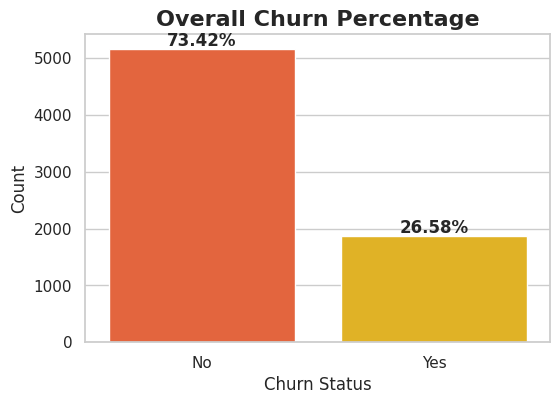
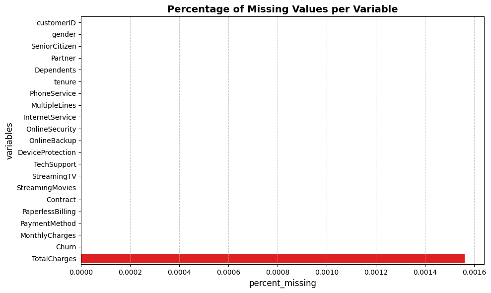
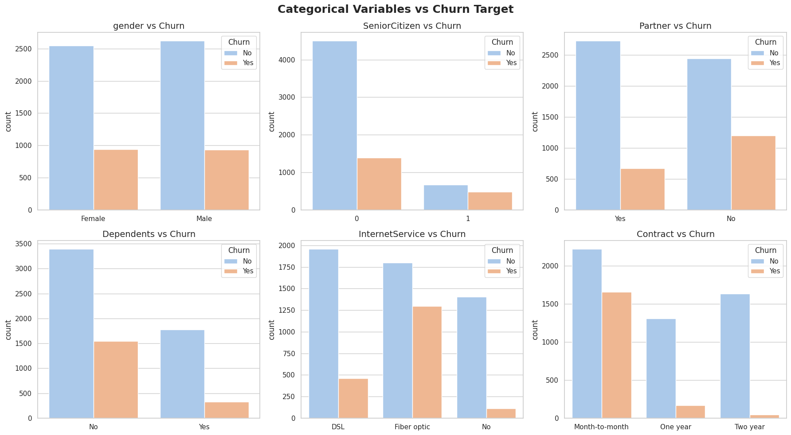
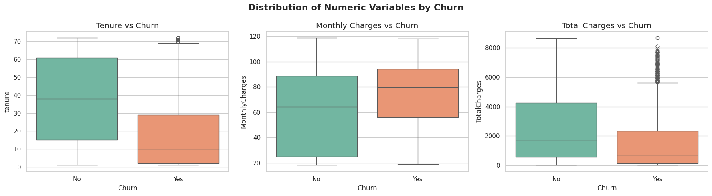
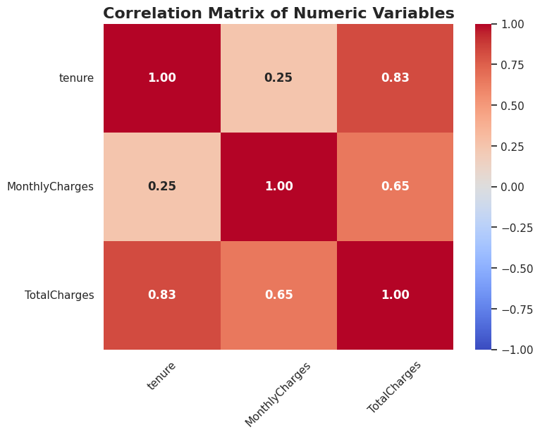

---

## Final Model Evaluation
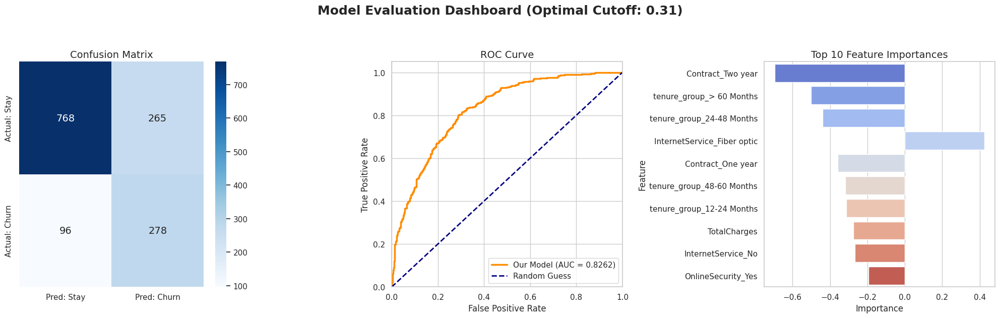

---

## Custom Support Vector Classifier (SVC) Evaluation

### Quantitative Performance
* **Accuracy:** 0.7967
* **AUC Score:** 0.8175

### Performance Visualizations
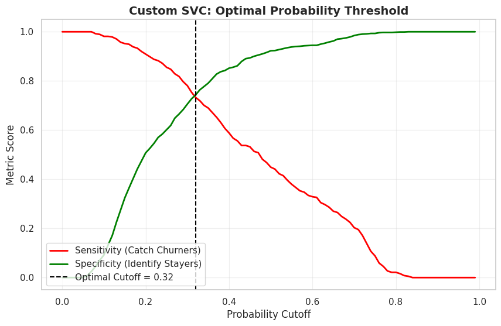
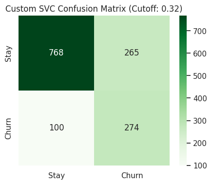
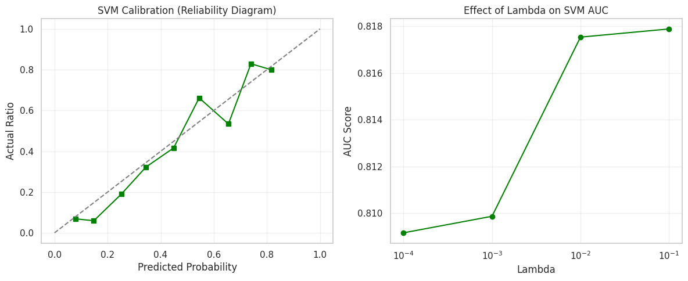

---

## Random Forest Evaluation

### Quantitative Performance
* **Accuracy:** 0.7925
* **AUC Score:** 0.8071

### Performance Visualizations
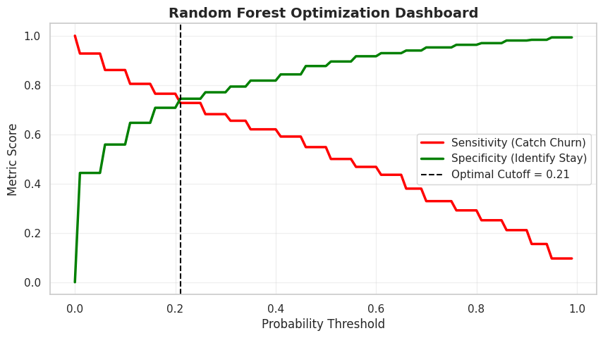
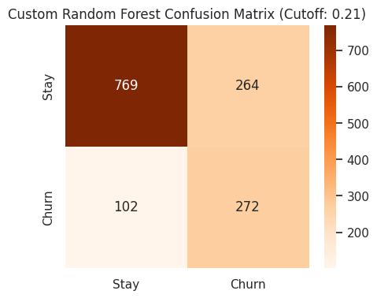
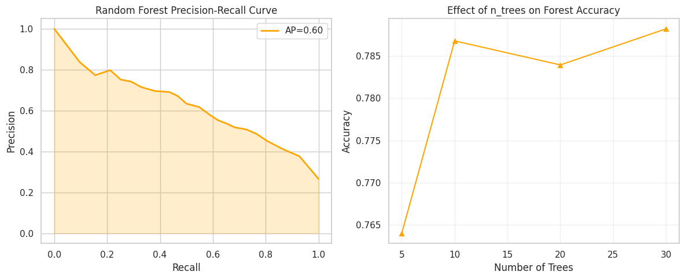

---

## Artificial Neural Network (ANN) Evaluation

### Classification Report (Optimal Cutoff = 0.31)
| Class | Precision | Recall | F1-Score | Support |
| :--- | :--- | :--- | :--- | :--- |
| **Stay (0)** | 0.89 | 0.74 | 0.81 | 1033 |
| **Churn (1)** | 0.51 | 0.74 | 0.61 | 374 |
| **Overall Accuracy** | | | **0.74** | 1407 |

*Note: Hyperparameter tuning determined that 8 neurons in the hidden layer provided the best performance (AUC: 0.8263 over 3000 epochs).*

### Performance & Thresholds
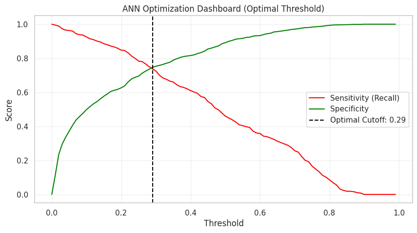
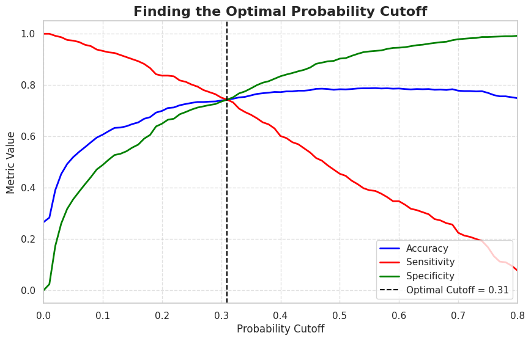
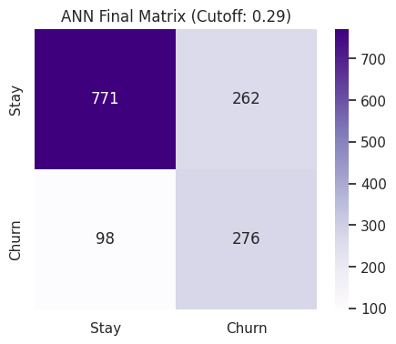
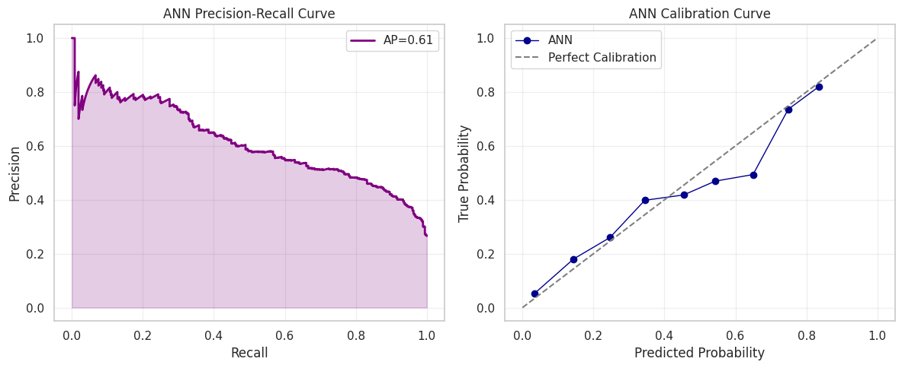

### Hyperparameter Tuning
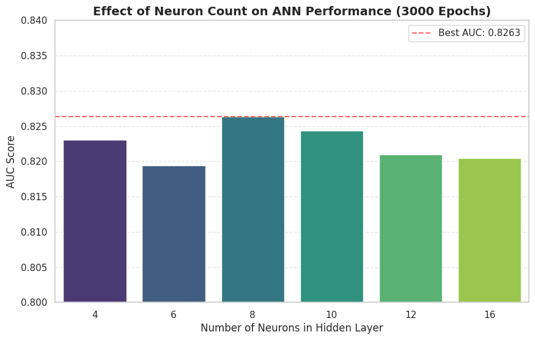
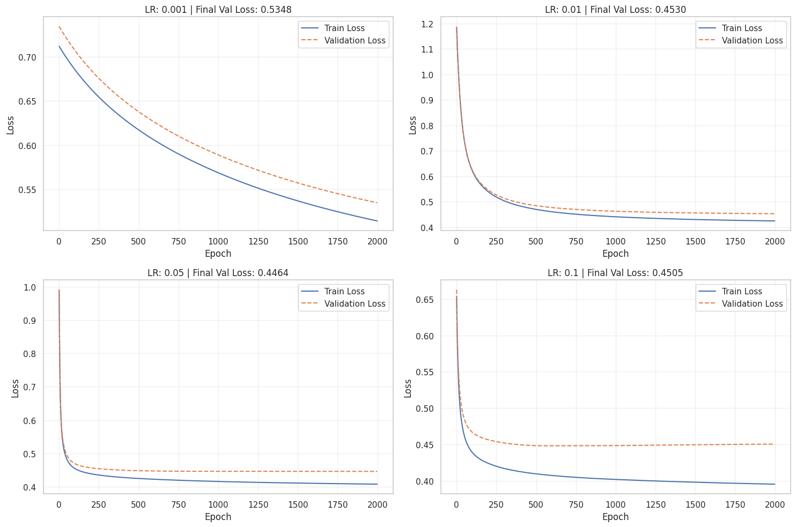
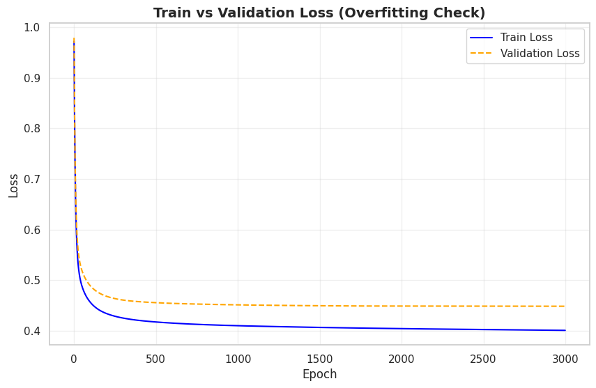
